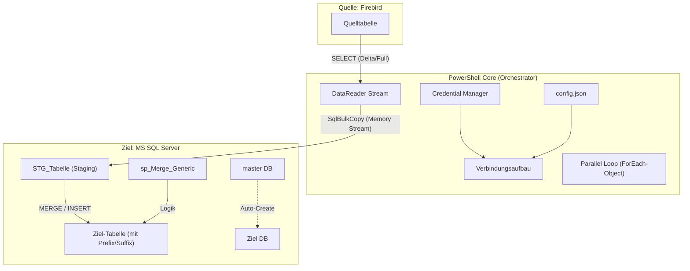

# Firebird-to-MSSQL Synchronization Suite

Diese Suite bietet eine automatisierte, parallelisierte Lösung zur Synchronisation von Daten aus einer Firebird-Datenbank in einen Microsoft SQL Server. Sie setzt auf eine modulare PowerShell-Architektur (`SQLSyncCommon`) für hohe Wartbarkeit und Sicherheit.

---

## 1. Architekturübersicht

Das System arbeitet nach dem **ELT-Prinzip (Extract, Load, Transform)** und nutzt einen Staging-Ansatz, um die Belastung der Quellsysteme zu minimieren und maximale Schreibgeschwindigkeit im Ziel zu erreichen.

### Datenfluss-Diagramm



### Kernkomponenten

- **Controller (`Sync_Firebird_MSSQL_AutoSchema.ps1`)**: Das Hauptskript. Es initialisiert die Umgebung, prüft Voraussetzungen (Pre-Flight Check via `master` DB), lädt Treiber und verarbeitet die konfigurierten Tabellen parallel.
- **Modul (`SQLSyncCommon.psm1`)**: Eine zentrale Bibliothek für wiederkehrende Aufgaben:
  - Sicheres Abrufen von Credentials (`Get-StoredCredential`).
  - Laden und Validieren der Konfiguration (`Get-SQLSyncConfig`).
  - Typ-Konvertierung zwischen .NET und SQL Server (`ConvertTo-SqlServerType`).
  - Treiber-Management (`Initialize-FirebirdDriver`).
- **SQL-Backend**:
  - **Staging**: Temporäre Tabellen (`STG_*`) für den schnellen Import.
  - **Stored Procedure (`sp_Merge_Generic`)**: Führt den eigentlichen Abgleich (Merge) zwischen Staging und Zieltabelle durch.

---

## 2\. Installations- & Einrichtungsprozess

Der Prozess ist in logische Schritte unterteilt, um eine sichere und funktionierende Umgebung zu gewährleisten.

### Schritt A: Grundvoraussetzungen

- **PowerShell 7+**: Zwingend erforderlich für die Parallelverarbeitung (`-Parallel`).
- **Zugriffsrechte**:
  - Firebird: Lesezugriff.
  - MSSQL: Rechte zum Erstellen von Datenbanken (`db_creator`) oder Tabellen.

### Schritt B: Konfiguration (`config.json`)

Erstellen Sie eine `config.json` basierend auf der `config.sample.json`.

| Sektion      | Wichtige Parameter     | Beschreibung                                                              |
| :----------- | :--------------------- | :------------------------------------------------------------------------ |
| **General**  | `GlobalTimeout`        | Maximale Laufzeit für Operationen.                                        |
|              | `RecreateStagingTable` | Erzwingt Neuerstellung der Staging-Struktur.                              |
|              | `CleanupOrphans`       | Aktiviert das Löschen von Datensätzen im Ziel, die in der Quelle fehlen.  |
| **Firebird** | `DllPath`              | Pfad zur `FirebirdSql.Data.FirebirdClient.dll` (wird bei Bedarf geladen). |
| **MSSQL**    | `Prefix` / `Suffix`    | Namenskonvention für Zieltabellen (z.B. `DWH_..._V1`).                    |

### Schritt C: Sicherheit (Credentials)

Hinterlegen Sie Passwörter **niemals** im Klartext in der Konfiguration. Nutzen Sie das bereitgestellte Skript, um diese im Windows Credential Manager zu speichern.

- **Skript**: `Setup_Credentials.ps1`
- **Speicherorte**: `SQLSync_Firebird` und `SQLSync_MSSQL`

### Schritt D: Validierung

Bevor der erste Sync läuft, prüfen Sie die Verbindung und Umgebung.

- **Skript**: `Test-SQLSyncConnections.ps1`
- **Prüft**:
  - Erreichbarkeit beider Datenbankserver.
  - Vorhandensein der `sp_Merge_Generic`.
  - Installierte Treiber-Versionen.

---

## 3\. Konfiguration der Synchronisation

### Tabellenauswahl (GUI)

Statt die JSON-Datei manuell zu bearbeiten, nutzen Sie den Manager. Er liest das Schema der Firebird-DB und bietet eine Auswahlmaske.

- **Tool**: `Manage_Config_Tables.ps1`
- **Funktion**:
  - Zeigt verfügbare Tabellen an.
  - Markiert Tabellen mit fehlender `ID` (Snapshot-Zwang).
  - Fügt neue Tabellen hinzu oder entfernt bestehende (Toggle-Logik).
  - Erstellt automatische Backups der `config.json`.

### Analyse-Hilfe

Bei Unklarheiten über Datentypen einer Quelltabelle:

- **Tool**: `Get_Firebird_Schema.ps1 -TableName "MEINE_TABELLE"`
- **Output**: Detaillierte Auflistung der .NET-Typen und Mapping-Vorschläge für MSSQL.

---

## 4\. Nutzung & Betrieb

### Manueller Start

Der Sync kann direkt über die PowerShell gestartet werden. Das Skript prüft automatisch, ob die Ziel-DB existiert (und erstellt sie bei Bedarf) und installiert notwendige Stored Procedures.

```powershell
# Standard (nutzt config.json)
.\Sync_Firebird_MSSQL_AutoSchema.ps1

# Mit spezieller Konfiguration (z.B. für Wochenende)
.\Sync_Firebird_MSSQL_AutoSchema.ps1 -ConfigFile "config_full_load.json"
```

### Automatisierung (Task Scheduler)

Für den regelmäßigen Betrieb steht ein Einrichtungs-Skript bereit.
**Wichtig**: Bearbeiten Sie die Pfade in der Datei vor der Ausführung\!

- **Skript**: `Setup_ScheduledTasks.ps1`
- **Standard-Jobs**:
  1.  **Daily Diff**: Mo-Fr, alle 30 Min (inkrementell).
  2.  **Weekly Full**: Sonntag früh (Vollabgleich/Reparatur).

---

## 5\. Kontrolle & Monitoring

### Logging

Jeder Lauf erzeugt ein detailliertes Transkript im Unterordner `Logs/`.

- Format: `Sync_<ConfigName>_<Timestamp>.log`
- Inhalt: Zeitstempel, Status pro Tabelle, Fehlerdetails, Zusammenfassung.
- **Auto-Cleanup**: Alte Logs werden basierend auf `DeleteLogOlderThanDays` (in `config.json`) automatisch gelöscht.

### Sanity Checks

Das System führt nach jedem Import einen Bestandsvergleich durch (sofern `RunSanityCheck: true`):

- Vergleicht `COUNT(*)` Quelle vs. Ziel.
- Meldet Differenzen als "WARNUNG" oder "FEHLER" in der Zusammenfassung.

### Strategien & Selbstheilung

Das System wählt pro Tabelle automatisch die passende Strategie:

1.  **Incremental**: Wenn `ID` und `GESPEICHERT` (Timestamp) vorhanden sind.
2.  **FullMerge**: Wenn nur `ID` vorhanden ist (Vergleich aller IDs).
3.  **Snapshot**: Wenn kein Primärschlüssel (`ID`) existiert (Truncate + Insert).

**Orphan Cleanup**:
Kann via Config (`CleanupOrphans: true`) aktiviert werden. Löscht Datensätze im Ziel, die in der Quelle nicht mehr existieren (über temporären ID-Abgleich).
