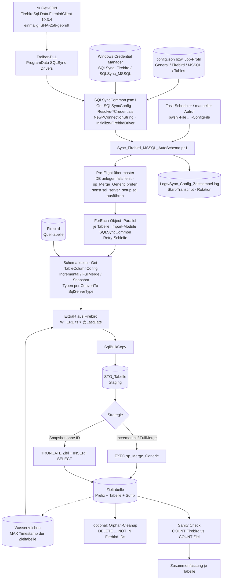
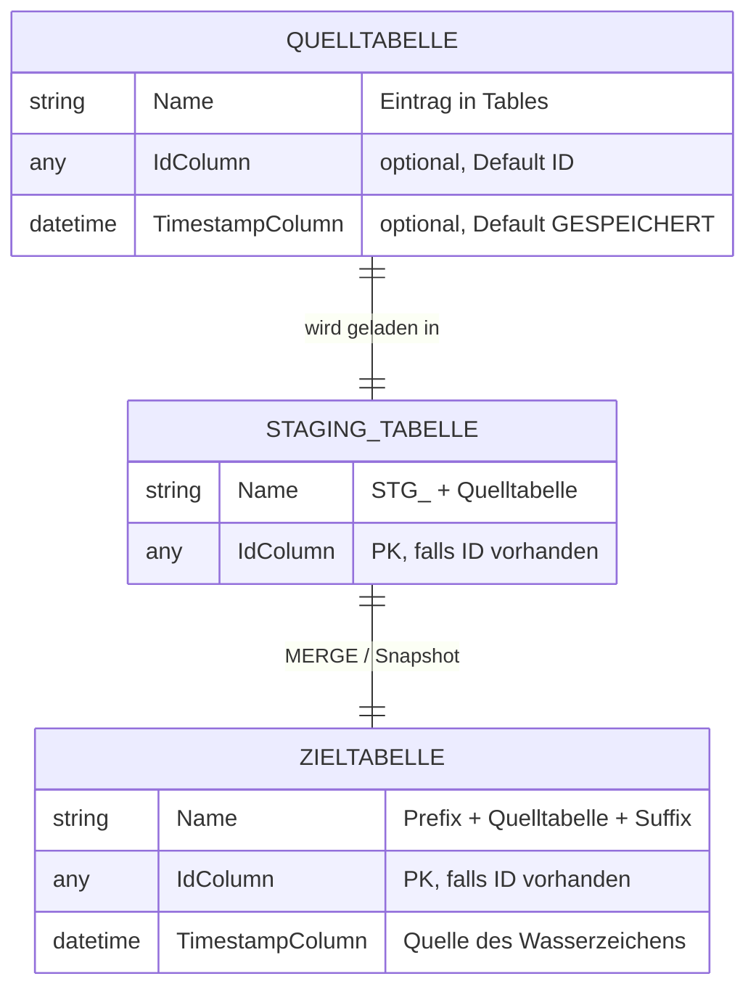
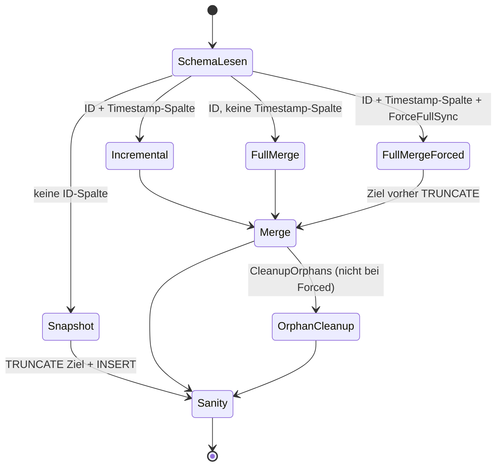

# Architektur-Übersicht – PSFirebirdToMSSQL

PowerShell-7-Werkzeug, das ausgewählte Tabellen einer Firebird-Datenbank (z. B. ERP-Tabellen) parallel,
inkrementell und per `SqlBulkCopy` in eine MS-SQL-Server-Datenbank repliziert:
Firebird → `STG_<Tabelle>` (Staging) → `MERGE` in die Zieltabelle. Typischer Betrieb: Task-Scheduler-Jobs
mit eigenen Konfigdateien (Job-Profile „Daily Diff" und „Weekly Full").

---

## Stack

| Schicht | Technologie |
|---------|-------------|
| Einstiegspunkte | PowerShell-7-Skripte im Repo-Root (`Sync_Firebird_MSSQL_AutoSchema.ps1` u. a.) |
| Gemeinsame Logik | PowerShell-Modul `SQLSyncCommon.psm1` (Konfig, Credentials, Connection Strings, Treiber, Typmapping) |
| Quelle | Firebird-Server (Port 3050) über `FirebirdSql.Data.FirebirdClient` 10.3.4 (.NET 8) |
| Ziel | MS SQL Server 2017+ über `System.Data.SqlClient`; T-SQL-Prozedur `dbo.sp_Merge_Generic` (`sql_server_setup.sql`) |
| Parallelität | `ForEach-Object -Parallel -ThrottleLimit NumberOfThreads` (eine Tabelle pro Runspace) |
| Auth | Windows Credential Manager (Targets `SQLSync_Firebird`, `SQLSync_MSSQL`), optional Windows-Auth für SQL Server; Klartext-Fallback in `config.json` |
| Betrieb | Windows Task Scheduler (`Setup-ScheduledTasks.ps1`), Logs per `Start-Transcript` in `Logs\` |
| Build | keiner (Skripte werden direkt ausgeführt; kein Manifest, keine Paketierung) |

---

## Scope-Grenzen — Was dieses System NICHT tut

- **Keine Echtzeit-/CDC-Replikation.** Läufe sind Batch-Jobs (Standard alle 30 Min werktags + wöchentlicher Full-Lauf).
- **Keine Live-Replikation von Löschungen.** Gelöschte Firebird-Datensätze bleiben im Ziel, außer bei `CleanupOrphans`
  (optional) oder Full-Lauf mit `ForceFullSync` (siehe [Entscheidung ADR-001](ADR/ADR-001-staging-merge-statt-direktem-upsert.md)).
- **Keine Rückrichtung.** SQL Server → Firebird wird nie geschrieben; Firebird wird nur gelesen.
- **Keine automatische Schema-Evolution der Zieltabelle.** Neue/geänderte Firebird-Spalten werden nur bei
  `RecreateStagingTable` in Staging übernommen; die Zieltabelle wird nur angelegt, nie erweitert.
- **Keine Transformation / Fachlogik.** Spalten werden 1:1 übernommen (nur Typmapping); keine Filter außer dem Wasserzeichen.
- **Keine Views, Stored Procedures oder Trigger aus Firebird** — nur Tabellen (`RDB$VIEW_BLR IS NULL`).
- **Andere Quellen als Firebird und andere Ziele als SQL Server** sind nicht angebunden.
- **Nur Windows.** Credential Manager (advapi32), `cmdkey`, Task Scheduler und `Out-GridView` setzen Windows voraus.
- **Kein Monitoring/Alerting** im Werkzeug selbst; seit Inkrement I2 ist der Erfolg eines Laufs am Exit-Code ablesbar (`0` OK, `10` Tabellenfehler, `11` Sanity `FEHLER`), die Auswertung bzw. Alarmierung liegt beim Betreiber (`operations/MONITORING.md`).

Änderungen an dieser Liste sind eine Architekturentscheidung → ADR erforderlich.

---

## Systemstruktur (Datenfluss)



Ablauf eines Laufs im Detail (Nummern = Abschnitte im Sync-Skript):

1. Modul laden → 2. Konfigpfad auflösen → 3. Transcript starten → 4. `Get-SQLSyncConfig` (Defaults + Validierung)
   → 5. Credentials auflösen → 6. Treiber laden, Connection Strings bauen.
2. **Pre-Flight** (7): über `master` die Zieldatenbank anlegen (Recovery `SIMPLE`, braucht `dbcreator`), dann
   `sp_Merge_Generic` prüfen (fehlt / Parameteranzahl ≠ 4 / `RecreateStoredProcedure`) und ggf. `sql_server_setup.sql`
   batchweise (Split an `GO`) ausführen.
3. **Hauptschleife** (8), je Tabelle in eigenem Runspace mit bis zu `MaxRetries + 1` Versuchen; der Runspace
   importiert zuerst das Modul (`Import-Module $using:ModulePath`):
   Schema lesen → ID-/Timestamp-Spalte und Strategie per `Get-TableColumnConfig` (`TableOverrides` > globale
   Werte) → Staging anlegen (Typen per `ConvertTo-SqlServerType` inkl. Precision/Scale)/leeren →
   Extrakt + `SqlBulkCopy` → Zieltabelle bei Bedarf anlegen, PK nachrüsten → `MERGE` bzw. Snapshot →
   optional Orphan-Cleanup → Sanity Check → Ergebnisobjekt.
4. Zusammenfassung (9), Log-Rotation (10), Exit-Code per `Get-SyncExitCode` (11, Zeile `ERGEBNIS: …`),
   `Stop-Transcript`, `exit $ExitCode`.

Details zur Fachlogik: `docs/features/firebird-mssql-sync.md`.

---

## Modul-Verantwortlichkeiten

```
Sync_Firebird_MSSQL_AutoSchema.ps1 → Orchestriert einen Lauf: Pre-Flight, parallele Tabellen-Synchronisation, Zusammenfassung, Log-Rotation
SQLSyncCommon.psm1                 → Gemeinsame Infrastruktur: Konfig laden/validieren, Credentials, Connection Strings, Treiber, Typmapping
sql_server_setup.sql               → Generische MERGE-Prozedur dbo.sp_Merge_Generic (Upsert Staging → Ziel, kein DELETE)
Setup_Credentials.ps1              → Legt die Credential-Manager-Einträge SQLSync_Firebird / SQLSync_MSSQL interaktiv an
Setup-ScheduledTasks.ps1           → Registriert die Task-Scheduler-Jobs Daily Diff / Weekly Full
Test-SQLSyncConnections.ps1        → Diagnose: Verbindungen, Versionen, Test-Abfrage, Existenz der Prozedur;
                                     mit -PreDeploy rein lesender Rollout-Check (Konfigs, Treiber-Hash,
                                     Server-Advisories, SYSDBA, Altbestand DECIMAL; Exit 6 bei FEHLER)
Get_Firebird_Schema.ps1            → Zeigt Spalten einer Firebird-Tabelle mit .NET- und SQL-Server-Typvorschlag
Manage_Config_Tables.ps1           → Pflegt die Tabellenliste in config.json per Out-GridView (mit Backup)
Example_Sync_Start.ps1             → Beispiel für zwei aufeinanderfolgende Läufe mit unterschiedlichen Konfigdateien
```

---

## Datenmodell (Kern-Entities)

Das Werkzeug hat kein eigenes fachliches Datenmodell; es verwaltet pro Quelltabelle drei Objekte:



---

## Zustandsmodell (Sync-Strategie je Tabelle)



Fehler in einem Schritt führen zum nächsten Versuch der Retry-Schleife; nach dem letzten Versuch Status „Fehler".

---

## Entscheidungsrelevante Constraints

| Constraint | Auswirkung |
|-----------|-----------|
| PowerShell 7.0+ | `ForEach-Object -Parallel`; jede Tabelle in eigenem Runspace, Modulfunktionen dort nicht automatisch verfügbar → jeder Runspace importiert `SQLSyncCommon.psm1` (`Import-Module $using:ModulePath`) und nutzt dessen Funktionen |
| Wasserzeichen = `MAX(ts)` der Zieltabelle, Vergleich `>` | kein separater Zustandsspeicher nötig; Datensätze mit gleichem/älterem Zeitstempel können übersprungen werden (Inkrement I8) |
| Staging + generische `MERGE`-Prozedur | Delta-Läufe ohne Löschungen; Löschungen nur über Orphan-Cleanup oder Weekly Full ([Entscheidung ADR-001](ADR/ADR-001-staging-merge-statt-direktem-upsert.md)) |
| Zieltabellen werden automatisch per `SELECT * INTO … WHERE 1=0` angelegt | Typen stammen aus dem Staging-Mapping (`ConvertTo-SqlServerType`, `DECIMAL(p,s)` aus dem Firebird-Schema seit v2.14); bestehende Tabellen werden nie geändert — Zieltabellen aus v2.13 oder älter behalten `DECIMAL(18,4)` (Migration: `operations/RUNBOOK.md`); keine automatische Spaltenerweiterung |
| Credentials im Credential Manager, `Persist = LocalMachine`, an das Windows-Konto gebunden | Task muss unter demselben Konto laufen, unter dem `Setup_Credentials.ps1` ausgeführt wurde |
| Treiber-Download braucht einmalig Admin-Rechte und Internetzugang | Erstinstallation als Administrator; danach Offline-Betrieb aus `%ProgramData%` |
| Auto-Create der Zieldatenbank über `master` | Konto braucht `dbcreator`, sonst Pre-Flight-Abbruch (Exit 9) — alternativ DB vorab anlegen |
| Exit-Code fasst alle Tabellen zusammen (`10` vor `11`; Sanity `WARNUNG` = `0`) | `LastTaskResult` sagt „etwas ist schiefgelaufen", welche Tabelle steht nur im Log (Inkrement I2, abgenommen 2026-10-08) |

---

## Lese-Pfad für Architektur-Details

1. **Diese Datei** (`OVERVIEW.md`) — Big Picture, Scope-Grenzen, Datenfluss.
2. `architecture/PROJECT_LAYOUT.md` — welche Datei welche Rolle hat.
3. `architecture/CONFIGURATION.md` — alle Konfigschlüssel mit Defaults.
4. `architecture/ERROR_HANDLING.md` — Exit-Codes, Retry, bekannte Schwächen.
5. `architecture/CREDENTIAL_STRATEGY.md` und `architecture/DEPENDENCIES.md`.
6. `architecture/ADR/` — Architekturentscheidungen, u. a.
   [Entscheidung ADR-001: Staging + MERGE statt direktem Upsert](ADR/ADR-001-staging-merge-statt-direktem-upsert.md).
7. `features/firebird-mssql-sync.md` — Fachlogik des Syncs; `operations/TASK_SCHEDULER.md` — Betrieb.

Begriffe und Geschäftssprache: `docs/GLOSSARY.md`.
Bekannte Einschränkungen und Probleme: `docs/KNOWN_ISSUES.md`.
