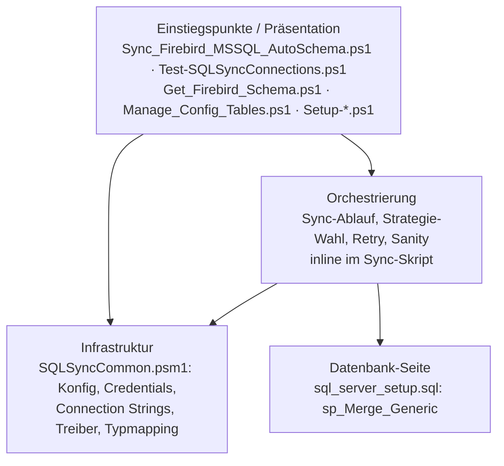

# Projekt-Layout – PSFirebirdToMSSQL

Tatsächliche Ordnerstruktur und Schichten-Zuordnung. Das Projekt nutzt bewusst ein **flaches Layout**:
alle ausführbaren Skripte, das Modul und die SQL-Datei liegen im Repo-Root, damit sie per
`$PSScriptRoot` ohne Pfadlogik zueinander finden und als Ordner auf den Zielserver kopiert werden können.

Verbindet sich mit den Prinzipien [[SEPARATION_OF_CONCERNS]] und [[ORTHOGONALITY]].

---

## Schichten-Modell



**Regeln für Abhängigkeiten:**

- Skripte importieren `SQLSyncCommon.psm1`; das Modul importiert nichts aus den Skripten.
- Das Modul kennt keine Tabellen-/Sync-Logik — es liefert Konfiguration, Credentials, Verbindungen und Typen.
- Es gibt keine eigene Domänenschicht: die Fachlogik (Strategie, Wasserzeichen, Merge) steckt im
  `ForEach-Object -Parallel`-Block des Sync-Skripts. Grund: Modulfunktionen sind im Parallel-Runspace nicht
  automatisch geladen. Herauslösen testbarer Teile (z. B. `Get-TableColumnConfig`, `ConvertTo-SqlServerType`)
  ist Inkrement I5.

---

## Tatsächliche Struktur

```
PSFirebirdToMSSQL/
├── Sync_Firebird_MSSQL_AutoSchema.ps1   # Haupt-Einstiegspunkt (Param -ConfigFile), Version 2.10
├── SQLSyncCommon.psm1                   # Gemeinsames Modul v1.0.0 (explizite Export-Liste, kein .psd1)
├── sql_server_setup.sql                 # CREATE OR ALTER PROCEDURE dbo.sp_Merge_Generic
├── Setup_Credentials.ps1                # Credential-Manager-Einträge anlegen (interaktiv)
├── Setup-ScheduledTasks.ps1             # Task-Scheduler-Jobs registrieren (Admin)
├── Test-SQLSyncConnections.ps1          # Verbindungs-/Setup-Diagnose
├── Get_Firebird_Schema.ps1              # Schema einer Firebird-Tabelle anzeigen
├── Manage_Config_Tables.ps1             # Tabellenliste in config.json pflegen (Out-GridView)
├── Example_Sync_Start.ps1               # Beispiel: zwei Läufe hintereinander
├── config.sample.json                   # Beispielkonfiguration (versioniert)
├── config.schema.json                   # JSON-Schema (versioniert, vom Code derzeit nicht ausgewertet)
├── config.json                          # Lokale Konfiguration (gitignored, kann Secrets enthalten)
├── config.json.<yyyyMMdd_HHmmss>.bak    # Backups von Manage_Config_Tables (gitignored)
├── README.md / README.de.md / README_alternativ.md   # Nutzerdoku EN / DE / alternative DE-Fassung
├── .github/copilot-instructions.md      # Agent-Hinweise (teilweise veraltet, Inkrement I10)
├── .gitignore
├── Logs/                                # Laufzeit: Sync_<ConfigName>_<yyyy-MM-dd_HHmm>.log (gitignored)
└── docs/                                # Dieses Doku-Set
```

Außerhalb des Repos (Laufzeit):

| Pfad | Inhalt |
|---|---|
| `%ProgramData%\SQLSync\Drivers\FirebirdSql.Data.FirebirdClient.10.3.4\` | entpacktes NuGet-Paket, geladen wird `lib\net8.0\FirebirdSql.Data.FirebirdClient.dll` |
| Windows Credential Manager | Generic Credentials `SQLSync_Firebird`, `SQLSync_MSSQL` |
| Task Scheduler | `SQLSync_Firebird_Daily_Diff`, `SQLSync_Firebird_Weekly_Full` |

Tests (Pester-5-Harness seit I3, Details in `docs/testing/UNIT_TESTS.md`):

| Pfad | Inhalt |
|---|---|
| `tests/RequiredModules.psd1` | gepinnte Testabhängigkeit: Pester 5.7.1 |
| `tests/pester.config.ps1` | Testlauf mit gepinntem Pester und Coverage auf `SQLSyncCommon.psm1` (Ziel 80 %); Exit 1 bei rotem Test oder Coverage unter Ziel |
| `tests/Unit/SQLSyncCommon.Tests.ps1` | 98 Unit-Tests, jede exportierte Funktion von `SQLSyncCommon.psm1` |
| `tests/coverage.xml` | Coverage-Report, vom Testlauf erzeugt, gitignored |

Aufruf: `pwsh -NoProfile -File .\tests\pester.config.ps1` (mit Coverage) oder `Invoke-Pester ./tests`
(schnell). Integrationstests (`tests/Integration/`) existieren noch nicht.

Repo-Hygiene (öffentliches Repository, Details `CONVENTIONS.md` 6.2):

| Pfad | Inhalt |
|---|---|
| `tools/git-hooks/pre-commit`, `tools/git-hooks/commit-msg` | rufen `check-internal-terms.sh` auf; aktiv nach `git config core.hooksPath tools/git-hooks` |
| `tools/git-hooks/check-internal-terms.sh` | blockt Commits mit Begriffen aus `.internal-terms` in neuen Zeilen, Dateinamen oder Commit-Message |
| `.internal-terms` | Denylist interner Begriffe, **gitignored** (lokal pflegen) |
| `docs/local/` | interne Umgebungsdoku (Hosts, Versionen, Test-Artefakte), **gitignored** |

Nicht vorhanden: `src/`, Build-Output, Modul-Manifest.

---

## Regeln

- **Neue Skripte in den Root**, solange das Layout flach bleibt; Modul-Import immer über `Join-Path $PSScriptRoot`.
- **Logik, die mehr als ein Skript braucht, gehört in `SQLSyncCommon.psm1`** und in dessen `Export-ModuleMember`-Liste.
- **Konfigdateien liegen neben den Skripten**; `-ConfigFile` akzeptiert absolute Pfade oder Namen relativ zum Skriptordner.
  Mehrere Konfigdateien = mehrere Job-Profile.
- **Laufzeitartefakte** (`Logs/`, `*.log`, `*.bak`, `*.dll`, `*.nupkg`) gehören in `.gitignore` (umgesetzt).
- **Tests** (sobald vorhanden) unter `tests/`, eine Testdatei pro Modulbereich.

---

## Anti-Pattern

- **Fachlogik doppelt pflegen:** Typmapping und Spalten-/Strategie-Ermittlung existieren inline im Sync-Skript **und**
  als `ConvertTo-SqlServerType` / `Get-TableColumnConfig` im Modul (weichen voneinander ab) — Inkrement I5.
- **Kopierte Hilfslogik:** Konfigpfad-Auflösung ist in zwei Skripten kopiert; `Get_Firebird_Schema.ps1` und
  `Manage_Config_Tables.ps1` lesen fest `config.json` — Inkrement I6.
- **Hart codierte Umgebungspfade** in `Setup-ScheduledTasks.ps1` — Inkrement I9.

---

## Pflege

Trigger (siehe `KICKOFF.md` Phase 3a): neue Datei im Root / neuer Unterordner / Verschiebung von Logik zwischen
Skript und Modul → diese Datei aktualisieren.
